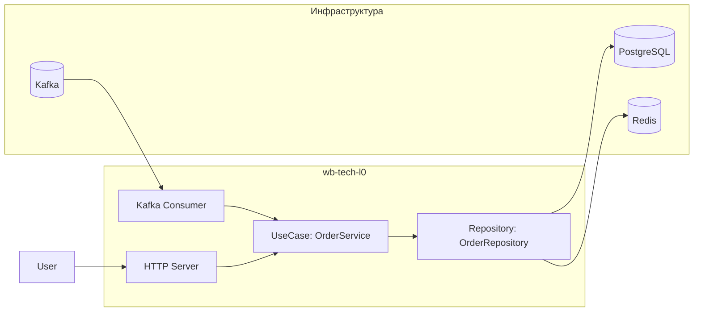
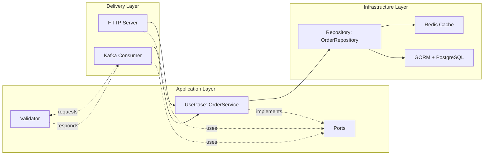
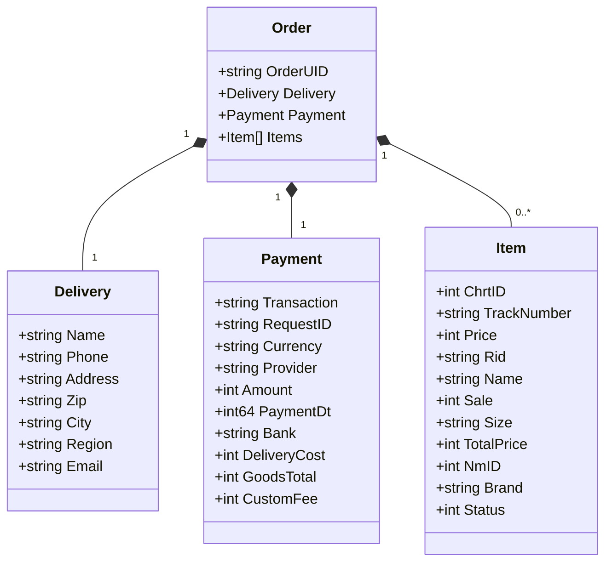
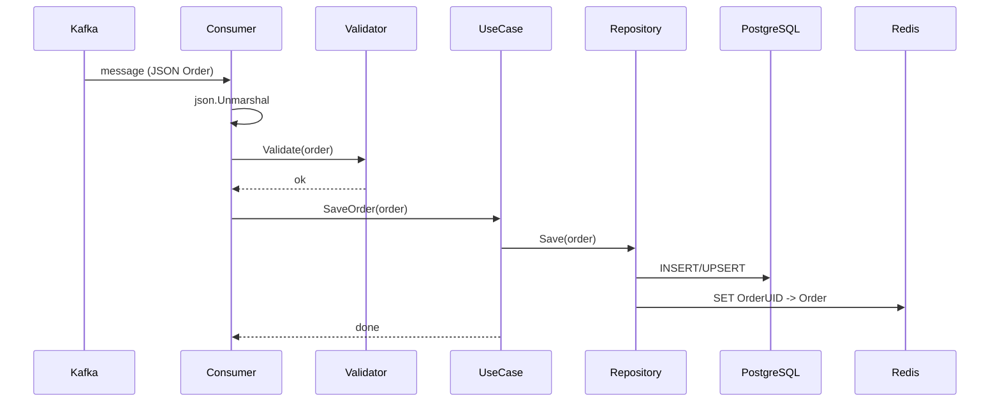

# wb-tech-l0

Сервис для приёма, валидации, сохранения и отдачи заказов. Проект реализован на Go, следует принципам чистой архитектуры (ports/usecases/adapters), использует Kafka для входящего потока заказов, PostgreSQL для долговременного хранения, Redis для кеширования и HTTP для выдачи данных пользователю.

## Содержание
- Возможности
- Архитектура и структура каталогов
- Технологии и зависимости
- Конфигурация
- Запуск и развертывание
- Жизненный цикл приложения
- Модель данных
- Тестирование
- UML-диаграммы (Mermaid, совместимо с GitHub)
- Планы/идеи улучшений

---

## Возможности
- Чтение заказов из Kafka топика, парсинг JSON.
- Валидация входных данных.
- Сохранение заказа и связанных сущностей в PostgreSQL с миграциями.
- Кеширование заказов в Redis для ускорения чтения.
- HTTP-интерфейс:
    - Страница поиска заказа по UID.
    - Отдача карточки заказа.
- Graceful shutdown для корректного останова.

---

## Архитектура и структура каталогов

В основе — многослойная архитектура с чётким разделением ответственности:

- cmd/
    - main.go — точка входа приложения, сборка инфраструктуры, запуск HTTP и Kafka.
    - server/ — HTTP-сервер (инициализация роутов, обработчиков и статических ресурсов).

- internal/
    - application/
        - ports/ — интерфейсы (контракты) между слоями:
            - order_usecase.go — интерфейс use-case слоя для работы с заказами.
            - order_repository.go — интерфейс репозитория заказов.
        - usecase/
            - order_service.go — бизнес-логика: сохранение/получение заказов, работа с кешом и БД через порты.
    - config/ — загрузка конфигурации (Viper/env/config.yaml).
    - delivery/
        - kafka/
            - consumer.go — адаптер Kafka: читает сообщения, валидирует, вызывает use-case для сохранения.
    - models/ — доменные модели: Order, Delivery, Payment, Item (используются в use-case и валидаторе).
    - repository/
        - cache/
            - cache.go — Redis-кеш заказов.
        - database/
            - database.go — инициализация GORM, AutoMigrate, внедрение кеша в репозиторий.
            - order_repository.go — реализация репозитория, сохранение/чтение заказов.
            - db_models/ — модели хранения для GORM (OrderDB, DeliveryDB, PaymentDB, ItemDB) и маппинг из домена.
    - validator/
        - validator.go — валидатор входных доменных моделей.
    - web/ — HTTP-слой (хендлеры/шаблоны интегрируются с cmd/server).

- templates/
    - index.html — форма поиска заказа.
    - order.html — страница заказа.
- static/
    - style.css — стили для страниц.
- tools/
    - fake_data_producer/ — генератор тестовых данных для Kafka (Dockerfile и producer).

- config.yaml — дефолтные настройки (адреса, DSN, тема Kafka, TTL кеша).
- docker-compose.yml — инфраструктура (Postgres, Redis, Kafka, приложение).
- Dockerfile, Dockerfile.debug — контейнеризация.

Ключевые потоки:
- Вход: Kafka -> delivery/kafka.Consumer -> validator -> application/usecase -> repository/database(+cache)
- Выход: HTTP -> application/usecase -> repository/cache or database -> templates/render

---

## Технологии и зависимости
- Язык: Go 1.25
- SDK: Go SDK 1.25.3
- Kafka: IBM Sarama client
- БД: PostgreSQL + GORM (миграции через AutoMigrate)
- Кеш: Redis (go-redis/v9)
- Конфигурация: Viper (+ env vars)
- Веб: стандартный http + html/template, статические файлы

---

## Конфигурация

config.yaml (можно переопределять переменными окружения):
- http_addr: адрес HTTP-сервера (например, ":8080")
- postgres_dsn: DSN PostgreSQL
- redis_addr: адрес Redis
- kafka_brokers: список брокеров Kafka
- kafka_topic: имя топика
- cache_ttl: TTL для кеша (duration)
- shutdown_timeout: таймаут graceful shutdown

Пример переменных окружения для CI/Prod:
- HTTP_ADDR
- POSTGRES_DSN
- REDIS_ADDR
- KAFKA_BROKERS (через запятую)
- KAFKA_TOPIC
- CACHE_TTL
- SHUTDOWN_TIMEOUT

---

## Запуск и развертывание

Вариант 1: Docker Compose
- Требуется Docker и Docker Compose.
- Проверьте/отредактируйте docker-compose.yml (Postgres, Redis, Kafka/ZooKeeper, приложение).
- Запуск:
    - docker compose up --build
- Останов:
    - docker compose down

Вариант 2: Локально
- Запустить инфраструктуру (Postgres, Redis, Kafka) локально/в Docker.
- Задать переменные окружения или отредактировать config.yaml.
- Установить зависимости:
    - go mod download
- Запуск:
    - go run ./cmd

HTTP по адресу из http_addr (по умолчанию http://localhost:8080).

---

## Жизненный цикл приложения

- main.go:
    - Загрузка конфигурации.
    - Инициализация Redis-клиента и кеша.
    - Инициализация GORM и миграций (AutoMigrate db_models).
    - Сборка use-case слоя.
    - Запуск HTTP-сервера.
    - Создание и запуск Kafka-консьюмера, чтение сообщений из заданного топика/партиции.
    - Graceful shutdown по сигналам ОС: корректная остановка HTTP и консьюмера, закрытие соединений.

- delivery/kafka.Consumer:
    - Читает сообщения из Kafka.
    - Парсит JSON в доменную модель Order.
    - Валидирует.
    - Делегирует сохранение в use-case.

- repository/database:
    - Сохраняет Order и связанные сущности через GORM.
    - При чтении — может обращаться к кешу, иначе к БД.

- web:
    - GET / — форма поиска по UID.
    - GET /order?uid=... — отображение информации о заказе или сообщение об ошибке.

---

## Модель данных (в упрощённом виде)

Домен:
- Order
    - Delivery
    - Payment
    - []Item

Хранилище (db_models):
- OrderDB (основная запись, ключ — OrderUID)
- DeliveryDB (FK: OrderUID)
- PaymentDB (FK: OrderUID)
- ItemDB (FK: OrderUID, позиции заказа)

Маппинг домен -> БД выполняется при сохранении (например, ToPaymentDB).

---

## Тестирование

Покрыты:
- Валидация моделей.
- Kafka consumer (через тестовый консьюмер/валидацию).
- Репозиторий (интеграционные/юнит через GORM).
- Доменные модели.
- Mocks для портов: cache, consumer, repository, usecase, validator.

Запуск тестов:
- go test ./...

---

## Диаграммы

### Диаграмма контейнеров

    
### Диаграмма слоёв архитектуры

### Диаграмма классов (доменная модель)

### Диаграмма последовательности (обработка сообщения из Kafka)

